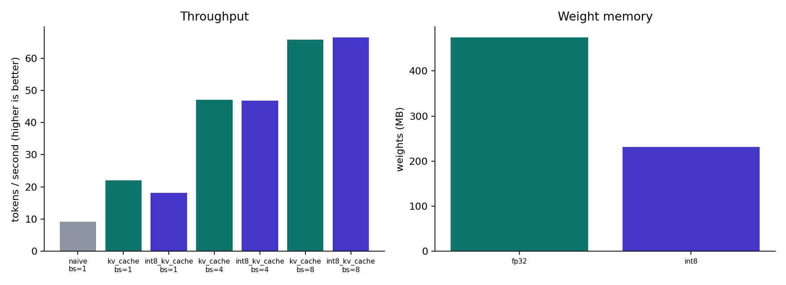

# MiniServe

A GPT-2 inference engine built from scratch in PyTorch — no `model.generate()`. It
implements the three ideas that make real LLM serving engines (vLLM, TGI, TensorRT-LLM)
fast, in their simplest correct form, and benchmarks each one against a naive baseline:

- **KV cache** — don't recompute attention over tokens you've already processed
- **Batched decoding** — left-padded prompts, per-row position ids, one forward pass for many requests
- **Int8 weight quantization** — symmetric, per-channel, about 4x smaller linear-layer weights
- **A FastAPI server + live dashboard** — generate text and watch the benchmark numbers

Design rationale and what each piece changes mathematically: [`docs/design.md`](docs/design.md).

## Results

Benchmarked on CPU, GPT-2 (124M), 24-token prompts, 40 new tokens, median of 3 runs
(`results/results.json`, regenerate with `python benchmark.py`). GPU numbers will look
different — the cache and batching wins hold, int8's relative speedup is usually larger.

| mode              | batch | tok/s | vs. naive | weights |
|-------------------|------:|------:|----------:|--------:|
| naive (recompute)  |     1 |   9.1 |      1.0x | 475 MB  |
| + KV cache         |     1 |  22.0 |      2.4x | 475 MB  |
| + KV cache         |     8 |  65.7 |      7.2x | 475 MB  |
| + int8 quantization|     8 |  66.5 |      7.3x | 232 MB  |

Int8 only quantizes the linear layers inside each transformer block (where most of the
*compute* is), not the token embedding table — so weight memory drops by about half
overall even though quantized linear layers are individually about a quarter of their
fp32 size. On CPU here, int8 doesn't beat plain KV-cached fp32 on speed (`torch`'s int8
kernels aren't BLAS-accelerated on this CPU); the GPU path is where int8 typically also
wins on throughput. That nuance is exactly the kind of thing the benchmark is designed to
surface rather than assume.

Correctness is asserted, not assumed: the cached output matches full recomputation
token-for-token, batched generation matches running each prompt alone, and int8 output
quality is measured (KL divergence and top-1 agreement vs. fp32) rather than eyeballed.
See `tests/test_miniserve.py` and the `checks` block `benchmark.py` writes to
`results/results.json`.



## Quickstart

```bash
pip install -r requirements.txt

# Run the test suite (model correctness, cache, batching, quantization)
pytest

# Benchmark against real GPT-2 weights (downloads ~500MB once) and write results/
python benchmark.py

# Or benchmark offline with random weights (no download, for a quick smoke test)
python benchmark.py --model random

# Start the server + dashboard at http://localhost:8000
uvicorn miniserve.server:app --reload
```

Set `MINISERVE_MODEL=random` before starting the server to run it fully offline.

## How it's organized

```
miniserve/
  model.py      GPT-2 forward pass + KVCache (no HF modeling code used at inference)
  weights.py    loads pretrained HF GPT-2 weights into the from-scratch model
  generate.py   naive / cached / batched decoding loop, with timing
  quant.py      Int8Linear + quantize_model()
  server.py     FastAPI app: /generate, /benchmark, /health
  static/       dashboard (vanilla HTML/CSS/JS, no build step)
benchmark.py    runs all modes, checks correctness, writes results/ + a chart
tests/          pytest suite, including exact-match checks against Hugging Face GPT-2
```
[dashboard](dashboard.png)
